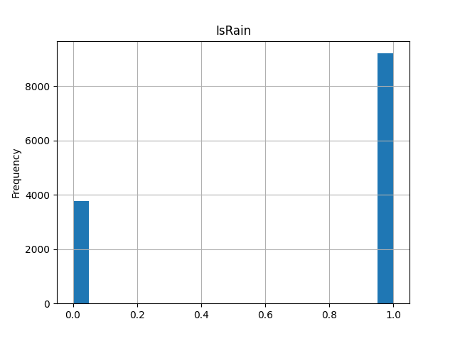
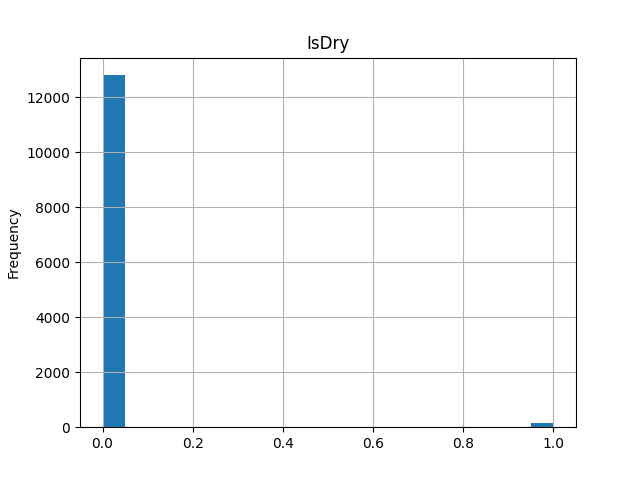

# Data analysis

## Analysis process

1. Identify and fix NaN values
   1.1. Dropped all row with Target == 0
2. Check if data are consistent - plot histograms, check if data "makes sense"
   One of issues:
   Features `IsRain` and `IsDry` are not consistent. Let's explain, there are `n` days, `a` rainy days.
   One would expect that there will be approximately `n` - `a` days with tag `IsDry`.
   Histograms does not show that. Data collection/meaning needs to be checked.<br>
   
   <br>
   Other issues:<br> 2.1. Too many days with snow - approximately 1/3 of days (Explanation: data from November to February) <br>
   2.2. `TemperatureMin/Max` correlates more with `AvgVolume7D` than `AvgVolume1D`.
   Would assume that actual temperature correlates more with 1 day average than 7 day average. <br>
   2.3. Values higher than certain treshold for `Days_BA_xxxx` are grouped to one value. Not really an issue <br>
3. Correlation: We are interested only in correlation with Target. We are not interested in correlation between Rain&Humidity.
Therefore check only correlation with Target (or its averages).
   VolumeAvg features were deleted from this analysis, as their high correlation with Target is obvious.
   
   Correlation for categoric variable, correlation for volume averages can be found in `graphs/correlation`.
   
### Results of correlation analysis:
TemperatureMax/Min has highest correlation.  </br>
Pressure, Humidity, WindSpeedPrecipIntCoefAvg14D, DaysBA_MgrHoliday has similar level of correlation.
Rest of the parameters has lesser influence.


## Models:

### Linear Regression:
Start with simplest possible model first. Few Features were choosen based on their correlation.
As expected, feature with highest correlation yielded best results. However, results were unusable.
```
 TemperatureMin score: 0.09618763543946818
 TemperatureMax score: 0.10140586279345987
 Humidity       score: 0.033103791104102664
 IsRain         score: 0.06536181221743975
 IsSnow         score: 0.06886704249387932
 WindSpeed      score: 0.019518505224818572
 IsCombinedVacations score: 0.03299835518501382
 DaysBA_MigrVacation score: 0.015404750150970203
```
Score is on training data. Model was not able to fit even training data.

### Polynomial Regression:

Maximal number of features we were able to fit polynomial regression on was 7 due to performance limitations.
